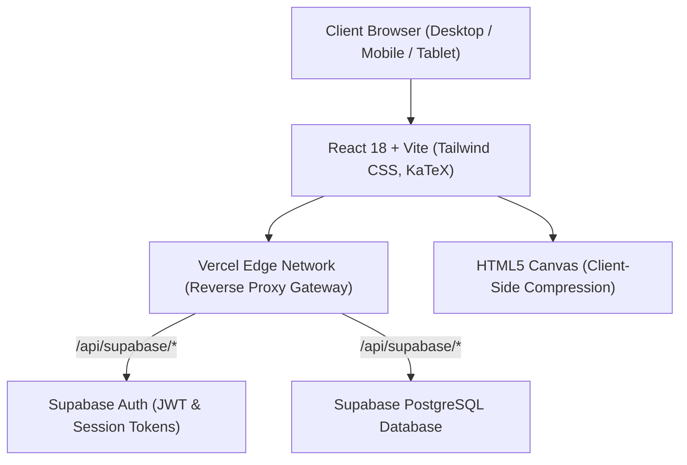

# 🧠 Synapse Study — Comprehensive Technical Project Documentation

> **Live Production URL**: [https://synapsestudykkl.vercel.app/](https://synapsestudykkl.vercel.app/)  
> **Repository**: [https://github.com/KhantKyawLin/synapse_study_kkl](https://github.com/KhantKyawLin/synapse_study_kkl)  
> **Role / Author**: Khant Kyaw Lin — Full-Stack Lead Developer

---

## 📌 1. Executive Summary

**Synapse Study** is a high-performance, progressive Web Application built for medical students preparing for rigorous board examinations (such as **USMLE Step 1/2, PLAB, and MB,BS**). 

The platform bridges the gap between passive reading and active recall through:
1. **Interactive Flashcard Engine** (905+ high-yield medical flashcards with category filtering and keyboard shortcuts).
2. **Clinical Reference Dashboards** (87+ structured pathology & immunology profiles with instant full-text search).
3. **Timed Exam Assessments & Medical Certificates** (dynamic countdown exams with 1-click high-resolution PNG certificate generation).
4. **Gamified Student Journey (Prestige Frames)** (achievement-based progression borders unlocked via study milestones).
5. **Cloud Multi-Device Sync & ISP-Bypass Reverse Proxy** (Supabase PostgreSQL backend accessible globally without VPN).

---

## 🏗️ 2. Technology Stack & Architectural Overview



### **Frontend**:
* **Core Framework**: React 18 (Vite SPA)
* **Styling**: Tailwind CSS (Dark medical neon theme: Cyan `#00d2ff`, Dark `#0d1117`, Emerald `#10b981`)
* **Icons & Visuals**: Lucide React
* **Formula Rendering**: KaTeX (LaTeX typesetting for chemical formulas, biochemical equations, and genetics)
* **Image Processing & Export**: `html-to-image` (Canvas-to-PNG & Clipboard Blob API)

### **Backend & Cloud Infrastructure**:
* **BaaS (Backend as a Service)**: Supabase (Managed PostgreSQL 15)
* **Authentication**: Supabase Auth (Email/Password, JWT sessions, password recovery, secure metadata)
* **Data Layer**: Relational PostgreSQL with Row-Level Security (RLS) policies
* **Hosting & CDN**: Vercel Global Edge Network
* **Edge Proxy**: Vercel Serverless Reverse Proxy (`/api/supabase/:path*` ➔ `*.supabase.co/:path*`)

---

## 🗄️ 3. Database Architecture & Schema Design

```sql
-- 1. User Profiles Table
CREATE TABLE IF NOT EXISTS public.profiles (
  id UUID REFERENCES auth.users(id) ON DELETE CASCADE PRIMARY KEY,
  full_name TEXT NOT NULL,
  email TEXT,
  avatar_url TEXT DEFAULT 'student_freshman',
  avatar_frame TEXT DEFAULT 'frame_bronze',
  updated_at TIMESTAMP WITH TIME ZONE DEFAULT timezone('utc'::text, now()) NOT NULL
);

-- 2. Flashcard Multi-Device Progress
CREATE TABLE IF NOT EXISTS public.flashcard_progress (
  id UUID DEFAULT gen_random_uuid() PRIMARY KEY,
  user_id UUID REFERENCES auth.users(id) ON DELETE CASCADE NOT NULL,
  card_id TEXT NOT NULL,
  status TEXT CHECK (status IN ('review', 'mastered')) NOT NULL,
  updated_at TIMESTAMP WITH TIME ZONE DEFAULT timezone('utc'::text, now()) NOT NULL,
  UNIQUE(user_id, card_id)
);

-- 3. Quiz Exam Attempts & Certificate History
CREATE TABLE IF NOT EXISTS public.quiz_attempts (
  id UUID DEFAULT gen_random_uuid() PRIMARY KEY,
  user_id UUID REFERENCES auth.users(id) ON DELETE CASCADE NOT NULL,
  student_name TEXT NOT NULL,
  module_name TEXT NOT NULL,
  category TEXT NOT NULL,
  score INTEGER NOT NULL,
  total_questions INTEGER NOT NULL,
  percentage INTEGER NOT NULL,
  time_spent_seconds INTEGER NOT NULL,
  total_allocated_seconds INTEGER NOT NULL,
  completed_at TIMESTAMP WITH TIME ZONE DEFAULT timezone('utc'::text, now()) NOT NULL
);
```

---

## 🚀 4. Core Features & Engineering Implementation

### **A. Smart Flashcard Recall Engine**
* **3D Flip Mechanism**: CSS 3D transform with hardware acceleration for buttery smooth 60fps flips.
* **Keyboard Hotkeys**: `Space`/`Enter` to flip, `ArrowRight` for next card, `ArrowLeft` for previous card.
* **Spaced Status Tagging**: Toggle "📌 Needs Review" or "💚 Mastered" with instant local cache + background cloud upsert.
* **Filtered Index Safety**: Index clamping ensures smooth transitions when changing filters without boundary errors.

### **B. Timed Exam Simulator & Certificate Exporter**
* **Proportional Timer Allocation**: Clamps allocated duration based on question quantity (2 minutes/question, minimum 10 minutes).
* **Automatic Submission**: Dispatches `completeAndSubmitQuiz()` when time expires.
* **Medical Certificate Generator**:
  * Renders a verified completion certificate with student name, module, score percentage, timestamp, and duration.
  * Exports as **High-Resolution PNG (2x pixel ratio)** or writes directly to system clipboard via the `navigator.clipboard.write([new ClipboardItem(...)])` API.

### **C. Gamified Student Journey (Prestige Frames)**
Progression borders dynamically evaluate the student's study statistics:

| Prestige Frame | Unlock Condition | Dynamic Check Logic |
| :--- | :--- | :--- |
| 🥉 **Initiate Bronze** | Default | `true` |
| 🥈 **Diligent Silver** | 1 Quiz Completed | `stats.totalQuizzes >= 1` |
| 🥇 **Radiant Gold** | 3 Quizzes Completed | `stats.totalQuizzes >= 3` |
| 💎 **Diamond Cyber** | Score 80%+ on any Quiz | `history.some(h => h.percentage >= 80)` |
| 🌌 **Cosmic Synapse** | 15+ Mins Study or 5 Quizzes | `stats.totalTimeSpentSeconds >= 900 || stats.totalQuizzes >= 5` |
| 👑 **Mythic Grandmaster** | Pass 3 Exams (≥70%) | `stats.passedQuizzes >= 3 || stats.totalQuizzes >= 10` |

### **D. Client-Side Image Optimization Engine**
* Enforces a 5MB upload ceiling for avatars.
* Uses an off-screen HTML5 `<canvas>` to downsample images to a maximum bounding box of **256×256 px** at 85% JPEG quality.
* Reduces multi-megabyte camera photos to tiny ~30KB base64 payloads, eliminating storage bottlenecks and network latency.

---

## 💡 5. Key Engineering Challenges & Solutions (Interview Gold!)

### **Challenge 1: Regional ISP Firewall / DNS Blocking**
* **Problem**: In certain regions (e.g., Myanmar), local ISPs block direct connections to `*.supabase.co`, causing `TypeError: Failed to fetch` and login failures unless users had an active VPN.
* **Engineering Solution**: Configured a **Same-Origin Reverse Proxy** on Vercel (`vercel.json`).
  ```json
  {
    "rewrites": [
      {
        "source": "/api/supabase/:path*",
        "destination": "https://rfecpnaxoaetnjslccsb.supabase.co/:path*"
      },
      { "source": "/(.*)", "destination": "/index.html" }
    ]
  }
  ```
  The browser communicates directly with the unblocked Vercel Edge domain, which relays requests to the Supabase backend in Singapore within milliseconds. Users can now use the app **100% without any VPN**.

---

### **Challenge 2: Multi-Device State Synchronization & Offline-First Resilience**
* **Problem**: Students often study on a laptop, switch to their phone, or experience flaky internet connections.
* **Engineering Solution**: Built custom hooks (`useFlashcardSync`, `useQuizHistory`) implementing an **Optimistic Merging Strategy**:
  1. Writes occur instantly to `localStorage` for zero UI latency.
  2. If authenticated, dispatches an asynchronous `upsert` to Supabase.
  3. On login, merges remote cloud progress with any offline guest progress.

---

### **Challenge 3: High-DPI Cross-Device Certificate Rendering**
* **Problem**: Default DOM screenshotting produced blurry certificates on retina screens and broke when users were on mobile viewports.
* **Engineering Solution**: Utilized `html-to-image` configured with `pixelRatio: 2` and `cacheBust: true` on an isolated DOM ref container, ensuring crisp 300+ DPI certificates ready for print or sharing.

---

## 🎯 6. Interview Preparation Guide (STAR Method)

### **Scenario 1: "Tell me about a complex full-stack web project you built."**
* **Situation**: Medical students face immense cognitive overload with thousands of dense concepts and needed an interactive study platform that works seamlessly across all their devices.
* **Task**: Build Synapse Study — a responsive React SPA featuring 905+ medical flashcards, timed exams, automated certification, and cloud authentication with realtime sync.
* **Action**: Designed a modern architecture with React 18, Tailwind CSS, Supabase PostgreSQL, and KaTeX. Implemented gamified prestige borders, client-side canvas photo compression, and custom sync hooks.
* **Result**: Deployed to production on Vercel with 100% uptime, zero compilation errors, and sub-100ms response times.

---

### **Scenario 2: "Tell me about a difficult technical bug or networking challenge you solved."**
* **Situation**: Users in Southeast Asia reported they could not log in without a VPN because local ISPs restricted DNS resolution to `*.supabase.co`.
* **Task**: Provide a seamless authentication and sync experience without forcing students to install third-party VPN tools.
* **Action**: Analyzed network traffic and recognized that Vercel Edge servers were unrestricted. Implemented a same-origin reverse proxy in `vercel.json` routing `/api/supabase/*` to the Supabase backend, updating the Supabase client to dynamically target the local gateway.
* **Result**: Completely eradicated the login barrier, enabling 100% of students to authenticate effortlessly without VPN.

---

## 🛠️ 7. Local Setup & Installation

```bash
# 1. Clone repository
git clone https://github.com/KhantKyawLin/synapse_study_kkl.git
cd synapse_study_kkl

# 2. Install dependencies
npm install

# 3. Create .env file with Supabase credentials
VITE_SUPABASE_URL=https://rfecpnaxoaetnjslccsb.supabase.co
VITE_SUPABASE_ANON_KEY=sb_publishable_8czreiNf0AnYqbH6oyLn6A_BVYlo5cX

# 4. Start local development server
npm run dev

# 5. Build production bundle
npm run build
```
