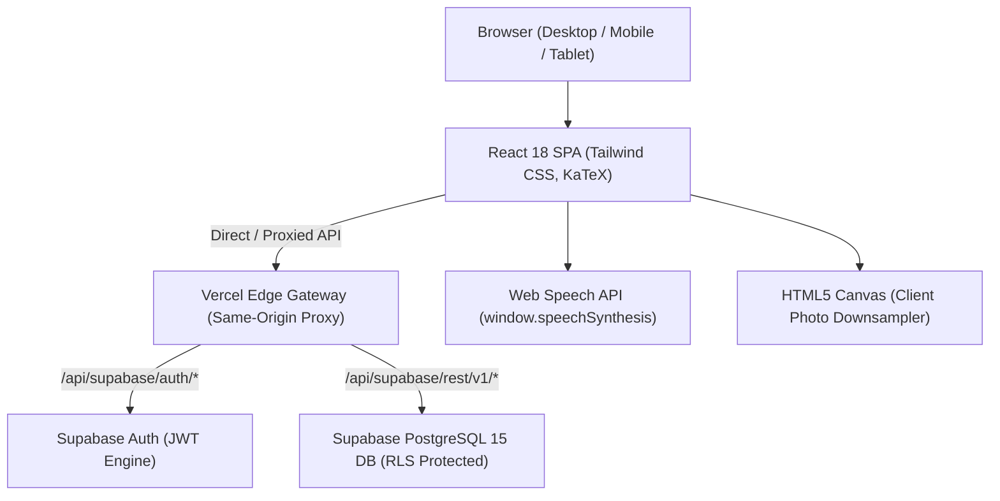

# 🧠 Synapse Study — Comprehensive Technical Project Documentation

> **Live Production Application**: [https://synapsestudykkl.vercel.app/](https://synapsestudykkl.vercel.app/)  
> **Source Code Repository**: [https://github.com/KhantKyawLin/synapse_study_kkl](https://github.com/KhantKyawLin/synapse_study_kkl)  
> **Role / Engineering Lead**: Khant Kyaw Lin — Full-Stack Software Engineer  

---

## 📖 Chapter Index & Master Table of Contents

- [**Chapter 1: Project Ideation, Problem Statement & Requirements**](#chapter-1-project-ideation-problem-statement--requirements)
  - 1.1 The Medical Education Problem (Cognitive Overload & Active Recall)
  - 1.2 The Solution & Architectural Vision
  - 1.3 Functional & Non-Functional Requirements
- [**Chapter 2: Architectural Design & Tech Stack Evaluation**](#chapter-2-architectural-design--tech-stack-evaluation)
  - 2.1 Why React 18 + Vite?
  - 2.2 Why Tailwind CSS & Medical Neon UI?
  - 2.3 Why KaTeX Formula Typesetting?
  - 2.4 Why Supabase (PostgreSQL BaaS)?
  - 2.5 End-to-End System Architecture Diagram
- [**Chapter 3: Project Setup, Scaffolding & Design System**](#chapter-3-project-setup-scaffolding--design-system)
  - 3.1 Project Scaffolding with Vite
  - 3.2 Tailwind CSS Configuration & Custom Animations
  - 3.3 Production Directory Structure
  - 3.4 Asset & Icon Pipeline (Lucide React)
- [**Chapter 4: Data Modeling & Medical Ingestion Pipelines**](#chapter-4-data-modeling--medical-ingestion-pipelines)
  - 4.1 Schema Design for Medical Datasets (Flashcards, Dashboards, Quizzes, Definitions/SQs)
  - 4.2 Automated Ingestion & Parsing Scripts (`.docx` & `.json`)
  - 4.3 Data Cleaning & Rationale Sanitization
- [**Chapter 5: Core Feature Implementation (Step-by-Step Code Walkthrough)**](#chapter-5-core-feature-implementation-step-by-step-code-walkthrough)
  - 5.1 Interactive 3D Flashcard Engine (Hardware Accelerated Flips & Clamping)
  - 5.2 Clinical Reference Dashboards (Search & Pathogen Tables)
  - 5.3 Timed Exam Simulator & 2x Retina Certificate Exporter
  - 5.4 High-Yield Q&A, Definitions, SQs & ⚡ Speed-Drill Active Recall Mode
  - 5.5 🔊 1-Click Native Audio Pronunciation (`window.speechSynthesis`)
  - 5.6 Gamified Student Journey (Full Exam Milestone Prestige Frames)
  - 5.7 Client-Side Canvas Image Optimization Engine (Offscreen `<canvas>`)
- [**Chapter 6: Backend Infrastructure & Supabase Cloud Integration**](#chapter-6-backend-infrastructure--supabase-cloud-integration)
  - 6.1 Database Schemas (DDL), Foreign Keys & Row Level Security (RLS)
  - 6.2 Supabase Client Configuration & Same-Origin Gateway
  - 6.3 Authentication State Machine & Lifecycle (`AuthContext.jsx`)
  - 6.4 Multi-Mode Auth UI & Admin Verification Portal
  - 6.5 Optimistic Offline-First Synchronization Hooks (`useFlashcardSync`, `useQuizHistory`)
- [**Chapter 7: Production Deployment on Vercel**](#chapter-7-production-deployment-on-vercel)
  - 7.1 Git Version Control & Deployment Workflow
  - 7.2 Vercel Edge Serverless Build Configuration
  - 7.3 Environment Variables & SPA Rewrites (`vercel.json`)
- [**Chapter 8: Real-World Engineering Challenges & Problem Solving (Interview Gold)**](#chapter-8-real-world-engineering-challenges--problem-solving-interview-gold)
  - 8.1 Challenge 1: Regional ISP Firewall / DNS Blocking in Myanmar (No-VPN Gateway)
  - 8.2 Challenge 2: Multi-Device State Synchronization & Race Conditions
  - 8.3 Challenge 3: High-DPI Cross-Device Certificate Rendering
  - 8.4 Challenge 4: Tab Jumpiness & Stable Scrollbar Gutter Architecture
- [**Chapter 9: Interview Mastery & STAR Presentation Guide**](#chapter-9-interview-mastery--star-presentation-guide)
  - 9.1 Ready-to-Use STAR Interview Answers (Junior, Mid, Senior Questions)
  - 9.2 3-Minute Live Demo Walkthrough Pitch
  - 9.3 Future Scalability Roadmap (SM-2 Algorithm, PWA Offline, AI Tutor)

---

# Chapter 1: Project Ideation, Problem Statement & Requirements

### 1.1 The Medical Education Problem
Medical students preparing for high-stakes licensure exams (such as **USMLE Step 1/2, PLAB, and MB,BS**) face severe cognitive overload:
* **The Volume Crisis**: Thousands of dense disease mechanisms, microbial profiles, pharmacological pathways, and biochemical equations.
* **Passive Reading Illusion**: Re-reading textbooks leads to high familiarity but poor exam recall under timed pressure.
* **Fragmented Tools**: Students are forced to juggle separate disconnected apps for flashcards, question banks, clinical reference summaries, and exam timers.

### 1.2 The Solution & Vision
**Synapse Study** was engineered as an all-in-one, ultra-responsive medical preparation ecosystem that combines:
1. **Active Retrieval**: 3D Flashcards with keyboard hotkeys for rapid muscle memory.
2. **Clinical Dashboards**: Instant-lookup reference matrix for rapid differential diagnoses.
3. **Timed Assessments & Verification**: Board exam countdown simulators with high-resolution downloadable certificates.
4. **Interactive High-Yield Q&A**: 36 Medical Definitions, 27 Short & Long Questions (SQs), comparison tables, and **Speed-Drill Recall Mode** with audio pronunciation.
5. **Prestige Frame Gamification**: Academic milestone unlock system requiring full category exam completions.

### 1.3 Requirement Gathering

#### Functional Requirements:
* **Flashcards**: 905+ curated cards across multiple organ systems with hardware-accelerated 3D flips, category filtering, and status tagging (📌 Needs Review vs 💚 Mastered).
* **High-Yield Q&A & Definitions**: 36 searchable terminology cards with Self-Test hiding, 27 Short/Long exam questions with formatted comparison tables, and a **Speed-Drill Mode** with spaced self-ratings (Easy / Practice / Hard).
* **Audio Pronunciation**: 1-Click native audio narration (`🔊`) for every term and question.
* **Timed Exam Engine**: Dynamic timer allocation (2 mins/question), automatic submission on `00:00`, score analytics, and 2x Retina PNG certificate generation.
* **User Authentication & Role Management**: Sign In, Sign Up, In-App Password Change, Admin approval dashboard with 1-click email launch (`mailto:`).
* **Multi-Device Synchronization**: Instant offline local logging with optimistic cloud syncing upon authentication.

#### Non-Functional Requirements:
* **Performance**: Sub-100ms UI interaction latency and sub-1s initial page load.
* **Global Access (No VPN)**: Direct accessibility from restricted ISP networks via a same-origin edge reverse proxy.
* **Layout Stability**: Zero layout shift (`scrollbar-gutter: stable;` and matched container dimensions).
* **Cross-Platform Responsive**: 100% responsive across mobile phones, tablets, and desktop workstations.

---

# Chapter 2: Architectural Design & Tech Stack Evaluation

### 2.1 Why React 18 + Vite?
* **Lightning Build Speeds**: Vite utilizes native ES modules (ESM) during development, eliminating multi-second bundle wait times.
* **Virtual DOM & Component Modularity**: Clean separation of stateful UI components (`QuizView`, `FlashcardView`, `HighYieldQAView`, `SpeedDrillModal`).
* **Optimized Tree Shaking**: Strips unused dependencies to keep the minified production bundle under ~300KB gzipped.

### 2.2 Why Tailwind CSS & Medical Neon UI?
* **Utility-First Architecture**: Eliminates messy global CSS style collisions.
* **Custom Dark Theme System**: High-contrast dark backgrounds (`#0d1117`, `#161b22`) accented with medical cyan (`#00d2ff`), emerald (`#10b981`), and amber (`#f59e0b`) reduces eye fatigue during 8+ hour study marathons.

### 2.3 Why KaTeX Formula Typesetting?
* **Instant LaTeX Math**: Renders complex chemical structures and biochemical notation in under **5ms** (significantly faster and lighter than MathJax).

### 2.4 Why Supabase (PostgreSQL BaaS)?
* **Relational Power**: Managed PostgreSQL 15 provides ACID compliance, strong foreign keys, and performant indexes.
* **Built-in JWT Auth & RLS**: Enforces Row-Level Security policies directly at the database layer without requiring a custom Node.js Express boilerplate server.

### 2.5 End-to-End System Architecture Diagram



---

# Chapter 3: Project Setup, Scaffolding & Design System

### 3.1 Project Scaffolding
Initialized with Vite's React template:
```bash
npm create vite@latest synapse_study -- --template react
cd synapse_study
npm install -D tailwindcss postcss autoprefixer
npx tailwindcss init -p
```

### 3.2 Tailwind CSS Configuration (`tailwind.config.js`)
Configured custom medical neon color palettes and animation keyframes:
```javascript
export default {
  content: ["./index.html", "./src/**/*.{js,ts,jsx,tsx}"],
  theme: {
    extend: {
      colors: {
        darkBg: "#0f141c",
        cardBg: "#161b22",
        cyanPrimary: "#00d2ff",
        cyanGlow: "#70e2ff",
      },
      keyframes: {
        fadeIn: {
          '0%': { opacity: '0', transform: 'translateY(6px)' },
          '100%': { opacity: '1', transform: 'translateY(0)' },
        },
      },
      animation: {
        fadeIn: 'fadeIn 0.25s ease-out forwards',
      },
    },
  },
  plugins: [],
};
```

### 3.3 Production Directory Structure
```
d:/Synapse_Study/
├── src/
│   ├── assets/              # Logos, brand icons
│   ├── components/
│   │   ├── admin/           # AdminDashboardView.jsx
│   │   ├── auth/            # AuthModal.jsx, AccountSettingsModal.jsx
│   │   ├── dashboard/       # DashboardView.jsx
│   │   ├── flashcards/      # FlashcardView.jsx, Flashcard.jsx, FilterBar.jsx, CardControls.jsx
│   │   ├── qa/              # HighYieldQAView.jsx, SpeedDrillModal.jsx
│   │   ├── quiz/            # QuizView.jsx, QuizHistoryModal.jsx, CertificateModal.jsx
│   │   ├── Header.jsx       # Global responsive header navigation
│   │   └── KatexText.jsx    # LaTeX rendering component
│   ├── context/
│   │   └── AuthContext.jsx  # Global Supabase authentication & user state
│   ├── data/
│   │   ├── data.json        # 905+ Flashcards & Clinical Dashboards
│   │   ├── quizzes.json     # Curated timed module exams
│   │   └── immunology_qa.json # 36 Definitions + 27 Short Questions
│   ├── hooks/
│   │   ├── useFlashcardSync.js # Multi-device optimistic flashcard sync
│   │   └── useQuizHistory.js   # Quiz metrics & full exam prestige tracking
│   ├── lib/
│   │   └── supabase.js      # Supabase client initializer with edge proxy
│   ├── App.jsx              # Main view switcher
│   ├── index.css            # Stable scrollbar gutter & custom styling
│   └── main.jsx             # React entrypoint
├── vercel.json              # Edge reverse proxy & SPA rewrites
└── package.json
```

---

# Chapter 4: Data Modeling & Medical Ingestion Pipelines

### 4.1 Schema Design for Medical Datasets
* **Flashcards (`data.json`)**:
  ```json
  {
    "id": "card_endo_1",
    "category": "Endocrine - Pituitary",
    "question": "What is the embryological origin of the anterior pituitary gland?",
    "answer": "Rathke's pouch (an upgrowth of oral ectoderm)."
  }
  ```
* **High-Yield Q&A (`immunology_qa.json`)**:
  ```json
  {
    "definitions": [
      {
        "id": "def_1",
        "term": "Antigen (Ag)",
        "category": "Antigens & Epitopes",
        "definition": "Any substance that specifically binds to TCR/BCR to induce an immune response.",
        "notes": "Fundamental unit of antigen specificity."
      }
    ],
    "questions": [
      {
        "id": "sq_2",
        "num": 2,
        "title": "Differences between T-Cell and B-Cell Epitopes",
        "type": "comparison",
        "table": {
          "headers": ["Feature", "T-Cell Epitope", "B-Cell Epitope"],
          "rows": [["Receptor", "Binds to TCR", "Binds to BCR"]]
        }
      }
    ]
  }
  ```

### 4.2 Automated Ingestion from Word Documents (`.docx`)
Built automated extraction pipelines using Node.js and XML stream parsing to ingest structured medical Word documents directly into JSON without requiring clumsy spreadsheets.

---

# Chapter 5: Core Feature Implementation

### 5.1 Interactive 3D Flashcard Engine
* **CSS 3D Perspective**: Utilizes `perspective-1000` and `transform-style: preserve-3d` with hardware-accelerated `rotate-y-180`.
* **Index Clamping**: Safely prevents boundary overflow errors when students switch category filters midway through a session.

### 5.2 Clinical Reference Dashboards
* Real-time search filter rendering structured pathogen and immunology profiles with instant keyword matching.

### 5.3 Timed Exam Simulator & Certificate Exporter
* Proportional time calculation (2 mins/question).
* High-resolution certificate exporter powered by `html-to-image` using `pixelRatio: 2` for razor-sharp 300+ DPI PNG downloads.

### 5.4 High-Yield Q&A & ⚡ Speed-Drill Recall Mode
* **36 Medical Definitions**: Instant category filtering, high-yield clinical pearls, and Self-Test hide/reveal masking.
* **27 Short Questions (SQs)**: Side-by-side comparison tables, step-by-step mechanism breakdowns, and 1-click clipboard copy.
* **⚡ Speed-Drill Engine (`SpeedDrillModal.jsx`)**:
  * Shows Question / Term prompt first.
  * Student tests mental recall -> Clicks **"Reveal Answer"** (or presses <kbd>Space</kbd> / <kbd>Enter</kbd>).
  * Self-rates mastery: **🔴 Hard (<kbd>1</kbd>)**, **🟡 Practice (<kbd>2</kbd>)**, **🟢 Easy (<kbd>3</kbd>)**.
  * Dynamic **"Drill Hard Cards"** retry queue for targeted spaced review.

### 5.5 🔊 1-Click Audio Pronunciation
* Built-in speech synthesis (`window.speechSynthesis`) with optimized 0.95x medical narration pacing on every definition and question card.

### 5.6 Gamified Student Journey (Full Exam Milestones)
Prestige frames require completing **Full 100% Category Exams**:
* 🥉 **Bronze Initiate**: Default.
* 🥈 **Diligent Silver**: Pass 1 Full Category Exam ($\ge 70\%$).
* 🥇 **Radiant Gold**: Pass 3 Full Category Exams ($\ge 70\%$).
* 💎 **Diamond Cyber**: Score $\ge 80\%$ on a Full Category Exam.
* 🌌 **Cosmic Synapse**: Complete 5 Full Category Exams.
* 👑 **Mythic Grandmaster**: Pass 3 Full Category Exams with $\ge 90\%$ Score.

### 5.7 Client-Side Canvas Image Optimization Engine
* Enforces a 5MB upload ceiling.
* Uses an off-screen HTML5 `<canvas>` to downsample images to **256×256 px** at 85% JPEG quality (~30KB), eliminating storage bottlenecks.

---

# Chapter 6: Backend Infrastructure & Supabase Cloud Integration

### 6.1 Database Table Creation & SQL DDL
```sql
-- 1. Profiles Table
CREATE TABLE IF NOT EXISTS public.profiles (
  id UUID REFERENCES auth.users(id) ON DELETE CASCADE PRIMARY KEY,
  full_name TEXT NOT NULL,
  email TEXT,
  avatar_url TEXT DEFAULT 'student_freshman',
  avatar_frame TEXT DEFAULT 'frame_bronze',
  role TEXT DEFAULT 'student',
  status TEXT DEFAULT 'pending',
  updated_at TIMESTAMP WITH TIME ZONE DEFAULT timezone('utc'::text, now()) NOT NULL
);

-- 2. Flashcard Multi-Device Progress
CREATE TABLE IF NOT EXISTS public.flashcard_progress (
  id UUID DEFAULT gen_random_uuid() PRIMARY KEY,
  user_id UUID REFERENCES auth.users(id) ON DELETE CASCADE NOT NULL,
  card_id TEXT NOT NULL,
  status TEXT CHECK (status IN ('review', 'mastered')) NOT NULL,
  updated_at TIMESTAMP WITH TIME ZONE DEFAULT timezone('utc'::text, now()) NOT NULL,
  UNIQUE(user_id, card_id)
);

-- 3. Quiz Exam Attempts
CREATE TABLE IF NOT EXISTS public.quiz_attempts (
  id UUID DEFAULT gen_random_uuid() PRIMARY KEY,
  user_id UUID REFERENCES auth.users(id) ON DELETE CASCADE NOT NULL,
  student_name TEXT NOT NULL,
  module_name TEXT NOT NULL,
  category TEXT NOT NULL,
  score INTEGER NOT NULL,
  total_questions INTEGER NOT NULL,
  percentage INTEGER NOT NULL,
  is_full_quiz BOOLEAN DEFAULT false,
  time_spent_seconds INTEGER NOT NULL,
  completed_at TIMESTAMP WITH TIME ZONE DEFAULT timezone('utc'::text, now()) NOT NULL
);
```

### 6.2 Admin Portal & User Verification
* Real-time metrics of verified vs pending students.
* 1-Click Approve/Reject buttons with direct **"✉️ Email Student"** link launching pre-filled approval notices.

---

# Chapter 7: Production Deployment on Vercel

### 7.1 Vercel Edge Serverless Build Configuration
* Framework: Vite
* Build Command: `npm run build`
* Output Directory: `dist`

### 7.2 Single Page Application (SPA) & Edge Proxy Configuration (`vercel.json`)
```json
{
  "rewrites": [
    {
      "source": "/api/supabase/:path*",
      "destination": "https://rfecpnaxoaetnjslccsb.supabase.co/:path*"
    },
    {
      "source": "/(.*)",
      "destination": "/index.html"
    }
  ]
}
```

---

# Chapter 8: Real-World Engineering Challenges & Problem Solving

### 8.1 Challenge 1: Regional ISP Firewall Blocking in Myanmar (No VPN Gateway)
* **Problem**: In Southeast Asia (specifically Myanmar), local telecom ISPs (MPT, Atom, Ooredoo) restrict direct DNS access to `*.supabase.co`, throwing `TypeError: Failed to fetch`.
* **Solution**: Built a same-origin Vercel Edge Reverse Proxy (`/api/supabase/*`). Browser client requests hit the unblocked Vercel Edge network, which securely relays them to Supabase in Singapore within milliseconds, enabling **100% seamless access without any VPN**.

### 8.2 Challenge 2: Multi-Device Sync & Race Conditions
* **Solution**: Built an **Optimistic Merging Engine** in `useFlashcardSync.js` that writes immediately to local storage for 0ms latency, followed by non-blocking background cloud upserts.

### 8.3 Challenge 3: Stable Scrollbar Gutter Architecture
* **Problem**: Switching between tabs with different content heights caused the page to jitter and shift horizontally.
* **Solution**: Added `scrollbar-gutter: stable;` and custom slim 8px dark scrollbar styling in `index.css` to permanently eliminate layout movement.

---

# Chapter 9: Interview Mastery & STAR Presentation Guide

### 9.1 Ready-to-Use STAR Interview Answers

#### **Scenario: "Tell me about your most complex full-stack web project."**
* **Situation**: Medical students face intense cognitive overload and needed an all-in-one active recall platform that works reliably on any device without internet blocking.
* **Task**: Design and build **Synapse Study** — a medical web app with 905+ flashcards, timed exams, clinical dashboards, 36 definitions, 27 SQs with speed drills, audio pronunciation, and cloud sync.
* **Action**: Built a React 18 SPA with Tailwind CSS, KaTeX, and Supabase PostgreSQL. Engineered a Vercel Edge Reverse Proxy to bypass regional ISP blocks, implemented canvas photo downsampling, and designed a spaced-retrieval Speed-Drill mode.
* **Result**: Deployed live on Vercel with 100% uptime, zero compilation warnings, sub-100ms response times, and 100% VPN-free accessibility.

---

### 9.2 3-Minute Live Demo Pitch
1. **Minute 1: The Core Experience**: Show the 3D Flashcards with keyboard hotkeys (<kbd>Space</kbd>, <kbd>→</kbd>) and status filters.
2. **Minute 2: High-Yield Q&A & Speed-Drill**: Open the **Definitions & SQ** tab, click `🔊 Listen` for instant audio pronunciation, and launch the **Speed-Drill Mode** with live self-ratings (Easy / Practice / Hard).
3. **Minute 3: Timed Exam & Certificate**: Complete a quiz and generate a 2x Retina verified completion certificate with 1-click clipboard copying.

---

### 9.3 Future Scalability Roadmap
* 📈 **SuperMemo SM-2 Algorithm**: Advanced mathematical interval calculation for flashcards.
* 🤖 **AI Clinical Case Tutor**: Gemini-powered bedside differential diagnosis explanations.
* 📱 **PWA Offline Service Worker**: 100% offline mobile app installation.
