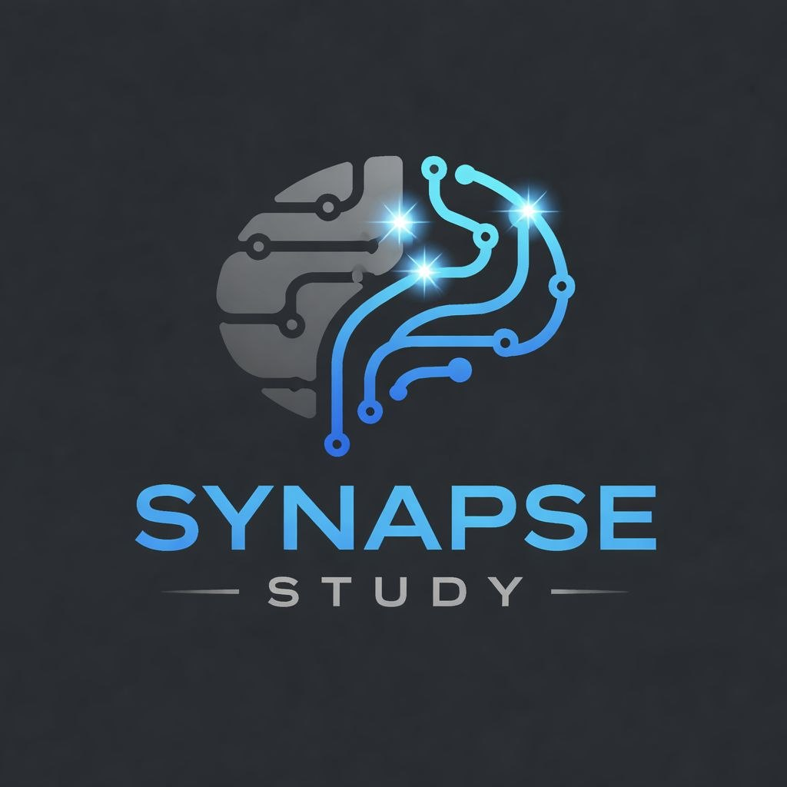

# 🧠 Synapse Study - Medical Education Platform

**Synapse Study** is a modern, high-performance web application designed for medical students to master complex subjects like **Immunology**, **Microbiology**, **Pathology**, **Physiology**, **Pharmacology**, **Surgery**, and **Medicine** through interactive digital flashcards, clinical summary dashboards, and timed practice exams.



---

## ✨ Key Features

### 📇 1. Interactive Medical Flashcards
- **3D Card Flip Animation**: Smooth CSS 3D perspective flips for questions and answers.
- **Bookmark & Mastery System**: Mark cards as **💚 Know (Mastered)** or **📌 Needs Review** with real-time counters and filter tabs.
- **LocalStorage Persistence**: Student progress and bookmarked cards are automatically saved in the browser.
- **LaTeX Math & Chemical Equations**: Rendered with KaTeX (e.g. $\text{Ca}^{2+}$, $60-75\%$).
- **Keyboard Shortcuts**: Arrow keys (`←` / `→`) to navigate, `Space` / `Enter` to flip.

### 📊 2. Universal Clinical Dashboards
- **3-Column Summary Cards Grid**: High-density medical disease and pathogen cards designed to fit on desktop screens without vertical scrolling.
- **Multi-Module Support**: **Immunology Database** (39 entries) and **Microbiology Database** (48 pathogen entries).
- **Glassmorphism Toolbar**: Instant filtering by Subject Module, Main Category, and Sub-Category.

### 🎯 3. Timed Practice Exam & Quiz Section
- **5-Choice Clinical Vignettes**: Multiple-choice format (`A`, `B`, `C`, `D`, `E`) with detailed board-style rationales.
- **Student Full Name Input**: Required student identification for verifiable screenshot submissions.
- **Dynamic Question Count & Sub-Topic Filtering**: Select 5, 10, 20, or All questions, filtered by sub-topic.
- **Allocated Countdown Timer**: 2 minutes per question (e.g., 5 Qs = 10 mins, 10 Qs = 20 mins, 20 Qs = 40 mins) with warning alerts and auto-submit on time expiry.
- **Verified Score Certificate**:
  - Displays Student Name, Score %, Correct Count, Time Taken, and Verification Timestamp.
  - **📸 Save Certificate Image (PNG)**: 1-click high-resolution PNG download.
  - **📋 Copy Image to Clipboard**: Direct image copy for WhatsApp, Email, or Google Classroom.

---

## 🛠️ Tech Stack

- **Frontend Core**: React 19, Vite 8, Tailwind CSS v4 (`@tailwindcss/postcss`).
- **Icons & Graphics**: Lucide React.
- **Math & Chemistry**: KaTeX (`katex`).
- **Image Export**: `html-to-image`.
- **Data Ingestion Pipeline**: Custom Node.js ES module parser ([`update.js`](update.js)) supporting CSV and Excel files.
- **Deployment**: Vercel Serverless Hosting.

---

## 📂 Project Structure

```text
├── dashboard_excel_files/      # Source CSV/Excel files for Dashboards (Immunology, Microbiology)
├── flash_cards_excel_files/    # Source CSV/Excel files for Flashcards (905+ cards)
├── quiz_excel_files/           # Source Excel practice exams (Physiology, Endocrine-1, etc.)
├── src/
│   ├── components/
│   │   ├── flashcards/         # FlashcardView, Flashcard, FilterBar, CardControls
│   │   ├── dashboard/          # DashboardView, DashboardToolbar, PathogenDetailGrid
│   │   ├── quiz/               # QuizView, QuizSetup, QuizCard, QuizResult
│   │   ├── Header.jsx          # Top Navigation Bar with active tab states
│   │   └── KatexText.jsx       # KaTeX formula renderer
│   ├── data/                   # Generated JSON databases (data.json, dashboards_data.json, quizzes_data.json)
│   ├── App.jsx                 # Main application view manager
│   └── index.css               # Tailwind CSS v4 configuration & theme variables
├── update.js                   # Node.js automated ingestion script for CSV/Excel data
└── package.json
```

---

## 🚀 Getting Started

### 1. Installation & Local Development

```bash
# Clone repository
git clone https://github.com/KhantKyawLin/synapse_study_kkl.git
cd synapse_study_kkl

# Install dependencies
npm install

# Run local development server
npm run dev
```

### 2. Production Build

```bash
npm run build
```

---

## 🤖 Data Ingestion & NotebookLM Integration

To add new flashcards, dashboards, or quizzes:
1. Drop your `.csv` or `.xlsx` files into the corresponding directory (`flash_cards_excel_files/`, `dashboard_excel_files/`, or `quiz_excel_files/`).
2. Run the update script:
   ```bash
   npm run update
   ```
3. Commit and push to GitHub — Vercel will automatically redeploy the updated content live!

---

## 📄 License
Developed by **[Khant Kyaw Lin](https://github.com/KhantKyawLin)**. Designed for medical students and educators.
